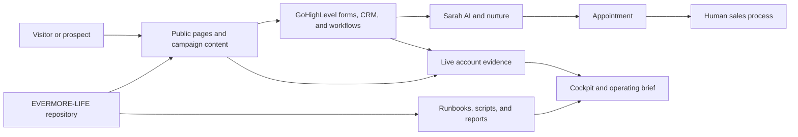

# Evermore Map And Compass

**Purpose:** Own and operate an evidence-backed lead-to-sale system.

**Current compass:** Finish and verify the complete lead path before increasing
traffic or spend.

## System Context

## Canonical Sources

| Question | Read first | Verification rule |
| --- | --- | --- |
| What is active now? | `00_START_HERE/README.md` | Check linked real files |
| How does infrastructure connect? | `SYSTEM_MAP.md` | Verify time-sensitive live claims |
| What should an operator do next? | `CODEX_MASTER_HANDOFF.md` and relevant handoff | Confirm it is still current |
| What is the public-site source? | `01_website/current/` | Compare with the live GHL page |
| Where is the private recruiting-page draft? | `01_website/v2/pages/recruiting.html` and the `/recruiting` proxy mapping | Keep noindex and verify the route after an approved deploy |
| Where are the standalone tool clean URL sources? | `score-tracker/index.html` and `growth-calculator/index.html` | Verify `https://evermorelife.org/score-tracker` and `https://evermorelife.org/growth-calculator` after push or deploy before calling them live |
| How are state-specific pages built? | `01_website/state-pages/` | Validate state mode, regenerate drafts, and verify live routing before publish |
| How should GHL be built? | `02_ghl/launch_kit/` | Verify inside GHL before completion |
| What campaign assets exist? | `04_content_narrative/` | Check destination URLs and publish state |
| What content is ready to edit, post, or promote? | `04_content_narrative/ad_campaign_scaffold/CONTENT_ACTIVATION_BOARD.md` | Verify real files, approvals, live routing, and paid gates |
| What automation is safe to run? | `04_tools/` and its handoffs | Review command and approval level first |
| What did a cartographer learn? | `BLUEPRINTS/reports/` | Prefer newer verified evidence |

## Core Surfaces

| Surface | Owner or system | Durable location |
| --- | --- | --- |
| Daily command and active rooms | Human operator + cockpit | `00_START_HERE/active/` |
| Website and funnel | GHL + repository source | `01_website/` |
| Standalone static tool routes | Public website source + static host | `score-tracker/index.html` and `growth-calculator/index.html` |
| Recruiting page draft | Human operator + website owners | `01_website/v2/pages/recruiting.html` plus `/recruiting` proxy route |
| State-page expansion | Human operator + website/GHL owners | `01_website/state-pages/` plus verified service and workflow evidence |
| CRM, forms, workflows, nurture | GHL | `02_ghl/` plus verified live evidence |
| Sales and marketing operations | Human operator | `03_sales_marketing/` |
| Campaign narrative and creative | Content systems | `04_content_narrative/` |
| Scripts and cockpit writers | Local automation | `04_tools/` |
| Cross-system intelligence | Humans + cartographer agents | `BLUEPRINTS/` |

## Map Maintenance Rules

- This file routes to truth; it does not replace truth.
- A live claim requires current live proof.
- A report records a survey. A decision changes direction.
- When a route changes, update this map and cite the report or decision that
  caused the change.
