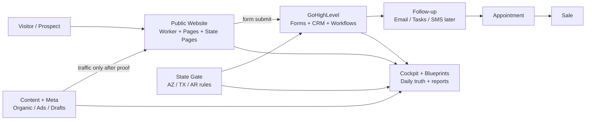
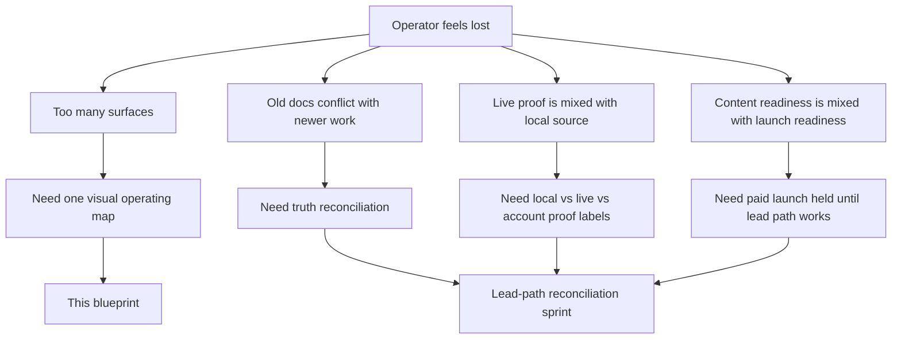
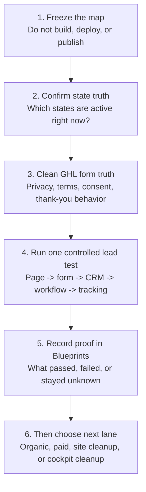

# Evermore Project Operating Blueprint

**Date:** 2026-06-25  
**Purpose:** Give the operator one visual, plain-English view of what is going
on across the Evermore project without changing, deploying, or fixing anything.

This is a navigation map. It is not a launch checklist and it does not claim
that live systems are healthy unless proof exists elsewhere.

## The Short Version

Evermore is not one project. It is one revenue system with several connected
surfaces:

1. Public pages get attention and collect interest.
2. GHL must capture the lead, prove consent, and start follow-up.
3. State rules decide who should enter the path.
4. Content and ads should only send traffic after the path works.
5. Cockpits and reports tell the operator what is true today.

Right now the main problem is not that there is no work. The problem is that
several surfaces disagree about what is true.

## Whole-System Map

## Current Project Surfaces

| Surface | What It Does | Main Files | Current State |
| --- | --- | --- | --- |
| Daily command center | Tells the operator what matters now | `00_START_HERE/README.md`, `00_START_HERE/active/` | Usable, but some older handoffs conflict with newer truth |
| Public website | Serves pages and clean routes | `01_website/v2/cloudflare/evermore-live-proxy.js`, `01_website/v2/pages/`, `01_website/current/` | Live/source truth needs reconciliation |
| State pages | Arizona, Texas, Arkansas page generation | `01_website/state-pages/data/states.json`, `01_website/state-pages/templates/state-page.html` | Source exists, but state status conflicts across docs |
| GHL lead path | Native form, CRM, workflow, consent, A2P | `02_ghl/launch_kit/` | Critical path, but live account proof is unavailable here |
| Content and ads | Organic drafts, Meta handoffs, launch controls | `04_content_narrative/`, `00_START_HERE/ADS_LAUNCH_CONTROL.md` | Assets/docs exist; paid launch remains on hold |
| Cockpit | Revenue dashboard and broad project cockpit | `00_START_HERE/COCKPIT_UPDATE_HANDOFF.md`, `04_tools/cockpit_update/` | Split is known; some schedule/task-state docs are stale |
| Standalone tools | Score tracker, growth calculator, agent suite pieces | `score-tracker/`, `growth-calculator/`, `login/`, `signup/`, `team/` | Some routes live, but not the current launch bottleneck |
| Blueprints | Durable map, reports, overlaps, decisions | `BLUEPRINTS/` | This is the right place for project truth |

## What Is Actually Blocking Clarity

## The Main Conflicts

| Conflict | Why It Matters | Where It Shows Up |
| --- | --- | --- |
| Website source truth | `current/`, `v2/pages/`, generated state pages, and Worker routing all play a role | `01_website/`, `BLUEPRINTS/MAP.md` |
| Active states | Some docs disagree about whether Texas or Arkansas is active/pending | `states.json`, GHL docs, content/Meta docs |
| GHL proof | Repo docs are ready-ish, but live CRM/workflow state needs authenticated proof | `02_ghl/launch_kit/` |
| A2P/SMS | A2P is approved/textable per operator confirmation; SMS still needs consent-gated workflow proof | `A2P_GAP_REPORT.md`, A2P pack |
| Paid ads | Content can exist before the lead path is safe to send traffic to | `ADS_LAUNCH_CONTROL.md`, `CONTENT_ACTIVATION_BOARD.md` |
| Cockpit state | Some generated/current cockpit views can still carry stale assumptions | `COCKPIT_UPDATE_HANDOFF.md`, `04_tools/CODEX_HANDOFF.md` |

## Current Stoplights

| Area | Status | Plain-English Meaning |
| --- | --- | --- |
| Public routes | Yellow | Many pages/routes exist, but source/live ownership must stay explicit |
| GHL form/workflow | Red/Yellow | Docs exist, but account-side proof is the missing piece |
| A2P/SMS | Yellow | Approved/textable; enable only consent-gated SMS and record STOP/START test proof |
| State targeting | Yellow/Red | Must pick one active-state truth before traffic |
| Organic content | Yellow | Draft material exists, but publishing still needs approval |
| Paid ads | Red | Hold until lead capture and tracking are proven |
| Cockpit | Yellow | Useful, but stale schedule/task-state references need cleanup later |
| Blueprints | Green/Yellow | Good system of record; needs this visual layer for operator clarity |

## The One Clear Path

## What Not To Do Yet

- Do not start paid ads.
- Do not publish or schedule organic content just because copy exists.
- Do not enable SMS workflow branches that are not gated by recorded consent and opt-out/DND checks.
- Do not change the approved A2P use case or sample-message pattern without reviewing compliance impact.
- Do not assume GHL is healthy from repo files alone.
- Do not clean up duplicates blindly from the dirty worktree.
- Do not treat old handoffs as current without checking newer Blueprint reports.

## What To Look At First

If the operator wants to regain control, use this order:

1. `BLUEPRINTS/PROJECT_OPERATING_BLUEPRINT.md` - this visual map.
2. `BLUEPRINTS/reports/2026-06-25_project-organization-swarm.md` - the swarm findings.
3. `00_START_HERE/README.md` - daily workspace.
4. `BLUEPRINTS/MAP.md` - canonical routing map.
5. `02_ghl/launch_kit/A2P_GAP_REPORT.md` - current GHL/A2P gaps.
6. `04_content_narrative/ad_campaign_scaffold/CONTENT_ACTIVATION_BOARD.md` - content/paid status.
7. `00_START_HERE/COCKPIT_UPDATE_HANDOFF.md` - cockpit update contract.

## If You Only Do One Thing Next

Do a lead-path reconciliation sprint.

That means: confirm the active states, verify/fix the GHL form settings, prove
the thank-you/Lead event behavior, and run one controlled test lead. Everything
else becomes easier after that because the project will have a proven path from
traffic to follow-up.
